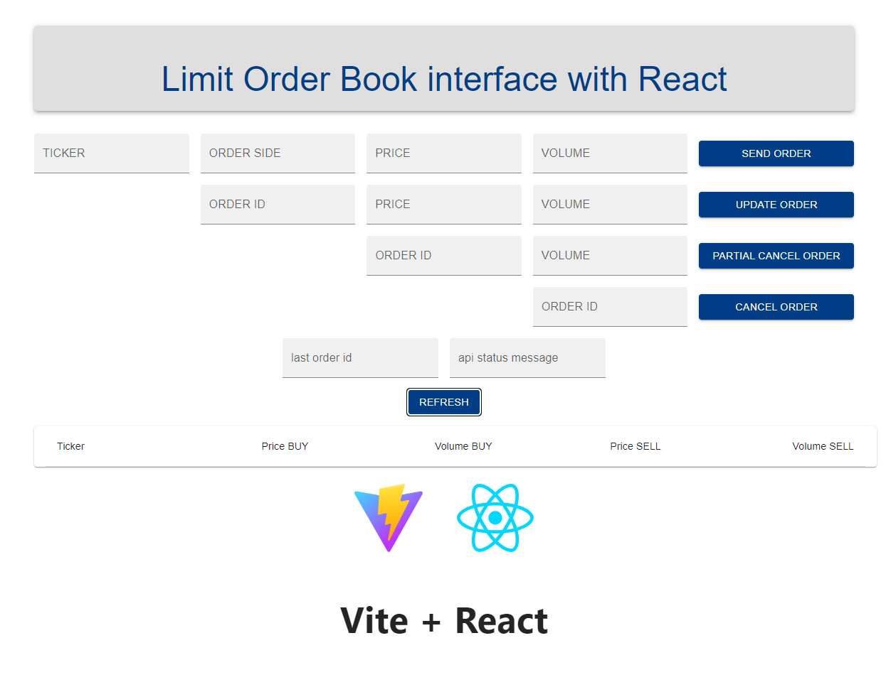

# Python-Limit-Order-Book

Double Side Limit Order Book implementation in Python

- plus webserver (web exposed backend REST API)
- plus command line interface (so you can talk to the backend REST API directly)
- plus web interface (so you can talk to it from a standard web browser, like Chrome)

## What is a Limit Order Book?

**A Limit Order Book is the core piece of infastructure used in a financial exchange, such as a stock exchange. They are used to match client buy and sell orders, enabling clients to trade.**

At a deeper level, a Limit Order Book (LOB) is a data structure which stores orders to buy and sell various instruments, at various discrete price levels, in varying volumes. A Limit Order Book also contains logic to match complementary orders, producing trades.

They are used across the Financial Services world in the context of Financial Exchanges. An Exchange is a location, virtual or real, which allows clients to meet and trade.

A Limit Order Book obtains its name from the concept of a *Limit Order*. This is an order to buy or sell some instrument at a price equal to or better than the *limit price*, with some fixed maximum quantity.

- For example, a client may submit an order to buy 10 shares of Nvidia stock (NVDA) at a limit price of \$131.38. This order may be filled by (meaning matched with) orders to sell the same stock at \$131.38 or higher.
- Alternatively, a client may submit an order to sell 10 shares of NVDA at a limit price of \$132.00. This order may be filled by orders to buy NVDA at \$132.00 or lower.
- In the implementation featured here, if there is any spread (meaning difference) between the buy and sell price, the aggressor order price is used as the fill price, meaning that the order which arrives first recieves the benefit from the improvement in fill price.
- Orders can only be filled if the spread is exactly zero (meaning the prices to buy and sell are the same) or if the sell price is less than the buy price.
- If the buy price is lower than the sell price, then there are no matchable orders because the price levels do not intersect. In this case, any submitted order becomes a *resting* order in the book, meaning that it remains there until either cancelled or a new order arrives with a matchable price.

# What is in this repository?

This repository consists of the source code for (primarily) three things

- A Limit Order Book implementation, which is wrapped with a FastAPI webserver. This is the "backend server". It presents a REST API interface to the "core" LOB.
- A client CLI which can interact with the backend webserver directly
- A whole website which is available at `www.python-limit-order-book.co.uk`

# Just show me how to run it

Well - what do you want to run?

This repository contains the source code for at least 3 things: A "core" Limit Order Book data structure, a backend server which presents a REST API to an instance of the core LOB, and a website built using the React + Vite framework, which presents a more user-friendly graphical interface.

- If you just want to see something working, go to `www.python-limit-order-book.co.uk` where you will find the website which displays the web interface to a backend server which hosts an instance of the core Limit Order Book logic. Jump to the **website** section for futher information.
- If you want to use the CLI to talk to the backend, jump to the **How to use the CLI** section for more information. The backend REST API is designed for computers to use, but humans can interface with it using the CLI as a helper, or by running `curl` commands from a terminal.
- If you are interested in the logic of the core LOB, you can clone this repository and write your own Python program which uses it.

The webserver is running on a Linode. This cloud based VM hosts the FastAPI backend, which provides a REST API to the Limit Order Book. It also hosts the website (frontend), which you can access using a web browser like any other website. There is a dns hostname setup to point to this servers IP address, at `www.python-limit-order-book.co.uk`. You can also interact with this address using the CLI.

## How to use the website

The screenshot below shows what the website looks like at the time of writing. The top section is a command interface, which is used to send, modify and cancel orders. The bottom section is a table showing the *top of book* state of the LOB.

**Top of Book:** Top of Book simply means the best buy and sell price for each instrument. It is quoted with a volume, showing the number of orders available to buy or sell with the top of book price.

#### Example instructions for use:

These instructions have been written assuming the order book is *empty*. If the order book is *not empty* then when you send an order there is a possibility that it will generate a trade. If this happens, you cannot follow these instructions *literally*, because some or all of your order will have been removed from the book due to trading activity.

1. Enter an order using the first row of text entry fields. For example:

```
TICKER: NVDA
ORDER SIDE: BUY
PRICE: 1000
VOLUME: 10
```

2. Press "Send Order". Assuming the order send correctly, the "last order id" box will be populated with an order id.

3. Press "Refresh" at the bottom of the command region to refresh the "Top of Book" state. You should see an order to buy 10 NVDA @ 1000.

4. Enter some values to modify the order using the second row of text entry fields. You will have to enter the same order id into the "ORDER ID" box. You can change the price, volume or both. Press "Update Order" to update the order values.

5. Press "Refresh" again to see the updated state of the Top of Book.

6. Use the penultimate row to cancel some remaining quantity of the order, or the final row to cancel the whole order.

Of course, by the time you are reading this it is likely someone else has entered some orders, so you could instead click "Refresh" to look at the current Top of Book state, and figure out what order to send to generate some trades.

*You won't see any output which indicates a trade has occured (yet) because I have not implemented this (yet). But you will know a trade has occured if the top of book volume reduces, or the price level changes.*



## How to use the CLI

This section is intended for more technical audiences.

The following bash commands show how to run the CLI on Linux. You need to be in the root directory, such that the `limit_order_book_cli` directory is accessable from the current working directory. See the section on Setup Instructions for more information.

```
$ cd Python-Limit-Order-Book
$ python3 -m venv .venv
$ source .venv/bin/activate
$ pip3 install -r requirements.txt
$ export PYTHONPATH=`pwd`
$ python3 -m limit_order_book_cli --help
```

#### To send an order to the Limit Order Book:

```
$ python3 -m limit_order_book_cli send-order TICKER ORDER_SIDE PRICE VOLUME
```

`TICKER` can technically be any string, but it is supposed to represent a ticker symbol like `AAPL` or `NVDA`.

`ORDER_SIDE` must be either the string `BUY` or `SELL`.

`PRICE` is an integer price value. It doesn't have any particular meaning since there are no instrument conventions to convert from an integer price scale to a real one in currency units. You can use the `top-of-book` command to find out what current valid top of book prices are, if one exists.

`VOLUME` is an integer number of units.

##### Return Value:

The webserver will return a JSON structure. This structure contains an `ORDER_ID`, which is a unique value. An `ORDER_ID` is automatically generated for each order which is sent.

#### To query the Top Of Book:

```
$ python3 -m limit_order_book_cli top-of-book TICKER
```

`TICKER` can technically be any string, but it is supposed to represent a ticker symbol like `AAPL` or `NVDA`.

#### Update, Cancel and Partial Cancel:

There are similar commands implemented in the CLI to update and cancel an order. The help option provides more information.

```
$ python3 -m limit_order_book_cli --help
```

### What about CURL?

You can use `curl` to send, update and cancel orders too. See the `curl_examples` directory.


# History

The original Limit Order Book was written as part of an interview process, although I happen to have written one previously (in Rust, not Python) during a previous role at a startup Hedge Fund.

- The original interview problem can be found in another repository. (https://github.com/edward-b-1/Python-Limit-Order-Book-Old) There are some issues with this implementation, to be expected as it had to be written quickly.

I realized that there was a more elegant way to write the Limit Order Book implementation, which is why I re-wrote the code. The new version can be found in the `limit_order_book` folder.

I thought it would be fun to wrap the "core" LOB with a REST API interface, and set this running on a cloud server somewhere. So I wrote the REST API server using FastAPI and deployed this to a cloud server. I wrote a command line interface (CLI), again using Python, which would allow users to download the Python CLI and interact with it. I also wrote examples using `curl` to demonstrate how to interact with it, for users who didn't want to use Python.

However, no one used it. (I know from the log activity.) I realized that this was probably too unfamiliar a technology for general audiences to understand what it was or what it did or how it worked.

So I wrote a website using React and Vite to create a more friendly user interface.

# Current State

The Limit Order Book Python package contains a working Limit Order Book implementation, and there are tests for it. The tests are located in the `tests` folder. There are numerous ways in which the Limit Order Book package could be extended and improved. The implementation is quite minimal.

The FastAPI wrapper package contains a minimal code to connect the Limit Order Book up to the internet. It also has tests, which can be found in the `tests/test_webserver` folder.

The CLI package contains the Command Line Interface which can be used to send messages to the Limit Order Book webserver. The CLI is contained in the folder `limit_order_book_cli`.

The Limit Order Book and Webserver implementations are quite minimal. This isn't designed to be as robust as real production software. You could probably find a way to break it relatively easily. (One obvious example is sending so many orders that the system runs out of memory.) If you do break it, please let me know that it is broken and ideally tell me what you did to break it. That way I can fix it. (But please don't deliberatly run it out of memory as this is an obvious failure mode which I already know about.)

# Setup Instructions (detailed)

Change directory to the root directory.

```
$ cd Python-Limit-Order-Book
```

Setup a virtual environment with pip. You will need the appropriate Linux package to be installed for this to work. On Debian based systems `sudo apt install python3.XX-venv` should install it. `3.XX` is the version number. It must match with the output of `python3 --version`.

For example, on my system: `sudo apt install python 3.12-venv`.

To create the virtual environment:

```
$ python3 -m venv .venv
```

Now, activate the virtual environment.

```
$ source .venv/bin/activate
```

Install the Python dependencies.

```
$ pip3 install -r requirements.txt
```

Actually, you can skip the following line. This was needed to get the `uvicorn` webserver to run locally, but you probably don't need it for the CLI.

```
$ export PYTHONPATH=`pwd`
```

Finally, run the CLI and print the help message. You can probably figure out the available options the CLI provides from here.

```
$ python3 -m limit_order_book_cli --help
```

# Technology Stack and How Does It Work?

The Limit Order Book is implemented with vanila Python. The only Python package used is `typeguard`. The Limit Order Book is a collection of containers (mostly dictionaries). It is designed to facilitate fast lookup and matching of orders. The code is written with an emphasis on functional style, and the general design philosophy used throughout is that functions should work in all contexts rather than raising exceptions. This leads to a fluid, rather than rigid, style of programming.

- For example: The update function takes an Order with an Order Id, Ticker and Order Side. These values do not change. An Order also has a Price value and a Volume. These can be changed by the call to `update()`. Since this function updates an order, a previous order should already exist in the Limit Order Book. Rather than performing a search to find the existing price and volume values, the logic just calls the `update()` function on *all* price levels. If a price level does not contain the order which we want to update, then the code simply does nothing. But the point is the function succeeds rather than fails.

The Webserver makes uses of the `FastAPI` web framework package. It provides a way to build robust and fast REST APIs quickly.

The CLI uses a Python package which is a close relative of `FastAPI`. It makes writing CLIs relatively straightforward. The CLI uses the Python `requests` package to talk to the Webserver.

The backend webserver is Dockerized, meaning that there is a `Dockerfile` which is used to build a Docker container. This Docker container is used to run the backend in the cloud. There is also a `docker-compose.yaml` which makes building and running the container even more easy.

The website is hosted using Nginx. Nginx also acts as a reverse proxy, directing requests to the backend webserver, if a request begins with `/api`.

